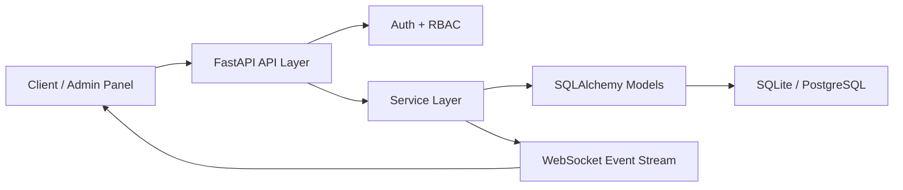

# StockFlow OMS

**StockFlow OMS** - полноценный backend-проект для управления заказами и складом, собранный как production-minded основа для e-commerce, логистики или внутренней операционной системы.

Репозиторий демонстрирует не только CRUD и REST API, а цельную backend-архитектуру:
- товары и складские остатки;
- заказы и смена статусов;
- пользователи, JWT-аутентификация и RBAC;
- отчётные endpoints;
- real-time обновления через WebSocket;
- структура, которую реально можно расширять под бизнес-задачи.

## Что умеет система

### Основной домен
- управление каталогом товаров;
- хранение остатков и зарезервированных единиц;
- создание заказов из нескольких позиций;
- автоматический резерв товара при создании заказа;
- списание остатков при завершении заказа;
- возврат резерва при отмене заказа;
- история смены статусов заказа.

### Безопасность
- JWT login;
- роли `admin`, `manager`, `operator`;
- доступ к операциям через `RBAC`;
- отдельные ограничения для админских и операционных сценариев.

### Аналитика и операционный контур
- dashboard summary;
- отчёт по low-stock товарам;
- готовность к расширению под аудит, уведомления, интеграции и фоновые задачи.

### Real-time
- WebSocket-канал `/ws/events`;
- события по изменениям заказов;
- события по изменениям остатков и созданию товаров.

## Архитектура



### Структура проекта

```text
app/
  api/            # маршруты FastAPI
  core/           # конфиг, БД, безопасность, realtime
  main.py         # точка входа приложения
  models.py       # SQLAlchemy модели
  schemas.py      # Pydantic схемы
  services.py     # бизнес-логика
  seed.py         # сидирование стартовых данных
```

## Технологии

- `Python`
- `FastAPI`
- `SQLAlchemy 2.0`
- `PostgreSQL`
- `SQLite` для быстрого локального старта
- `JWT`
- `RBAC`
- `WebSocket`
- `OpenAPI / Swagger`
- `Docker / Docker Compose`

## Доменные сущности

- `users`
- `products`
- `inventory_items`
- `orders`
- `order_items`
- `status_history`

## Логика ролей

### Admin
- полный доступ;
- управление пользователями;
- продукты, склад, заказы, отчёты.

### Manager
- продукты, склад, заказы, отчёты;
- без создания новых пользователей.

### Operator
- просмотр данных;
- создание заказов;
- обновление склада;
- без админских операций над пользователями.

## Быстрый запуск локально

```bash
python3 -m venv .venv
source .venv/bin/activate
pip install -r requirements.txt
cp .env.example .env
python -m app.seed
uvicorn app.main:app --reload
```

После запуска:
- API: `http://127.0.0.1:8000`
- Swagger UI: `http://127.0.0.1:8000/docs`
- ReDoc: `http://127.0.0.1:8000/redoc`

Дефолтный админ после `seed`:
- email: `admin@example.com`
- password: `admin123`

Demo-учётки для проверки ролей:
- `manager@example.com` / `manager123`
- `operator@example.com` / `operator123`

## Запуск через Docker

```bash
docker compose up --build
```

В этом режиме приложение стартует уже с PostgreSQL.

## Основные endpoints

### Meta
- `GET /`
- `GET /health`

### Auth
- `POST /api/v1/auth/login`

### Users
- `GET /api/v1/users/me`
- `GET /api/v1/users`
- `POST /api/v1/users`

### Products / Inventory
- `GET /api/v1/products`
- `POST /api/v1/products`
- `PATCH /api/v1/products/{product_id}`
- `PATCH /api/v1/products/{product_id}/inventory`
- `GET /api/v1/products/low-stock`

### Orders
- `GET /api/v1/orders`
- `GET /api/v1/orders/{order_id}`
- `POST /api/v1/orders`
- `PATCH /api/v1/orders/{order_id}/status`

### Reports
- `GET /api/v1/reports/dashboard`
- `GET /api/v1/reports/low-stock`

### Realtime
- `WS /ws/events`

## Пример рабочего сценария

1. Выполнить `seed`.
2. Залогиниться под админом.
3. Создать или посмотреть товары.
4. Создать заказ.
5. Перевести заказ в `completed`.
6. Проверить списание склада и dashboard-метрики.
7. Подключить WebSocket-клиент и получать live updates.

## Пример авторизации

```bash
curl -X POST http://127.0.0.1:8000/api/v1/auth/login \
  -H "Content-Type: application/json" \
  -d '{"email":"admin@example.com","password":"admin123"}'
```

## Почему этот проект выглядит “по-взрослому”

- домен разбит на сущности, а не свален в один файл с роутами;
- доступ контролируется через роли и зависимости;
- бизнес-логика вынесена в сервисный слой;
- БД отделена от API-слоя;
- есть real-time поток событий;
- локальный запуск простой, а deployment через Docker уже готов;
- проект можно развивать в сторону очередей, интеграций, аналитики и аудита.

## Что можно развивать дальше

- Alembic migrations;
- Redis / broker для распределённых событий;
- Celery / Dramatiq для фоновых задач;
- аудит действий пользователей;
- уведомления;
- интеграции с CRM / ERP / payment / shipping providers;
- CI/CD и production deployment.

## Название репозитория и topics

Рекомендуемое имя репозитория: `stockflow-oms`

Topics:

```text
fastapi
python
postgresql
inventory-management
order-management
warehouse-management
ecommerce-backend
rest-api
websocket
jwt-auth
rbac
openapi
backend-architecture
pet-project
```
