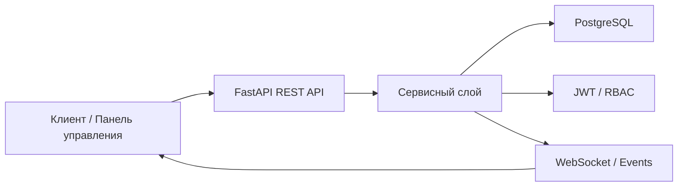

# StockFlow OMS

**StockFlow OMS** - мини-платформа управления заказами и складом, спроектированная как backend, максимально приближенный к реальным production-сценариям e-commerce и логистики.

Проект решает базовые задачи операционного контура:
- управление товарами и остатками;
- создание и сопровождение заказов;
- контроль статусов и бизнес-процессов;
- разграничение доступа по ролям;
- подготовка системы к росту нагрузки, данных и интеграций.

## Идея проекта

Целью было собрать не "учебный CRUD", а архитектурно внятную систему, которую можно использовать как основу для реального продукта:
- с нормальной структурой модулей;
- с понятной доменной моделью;
- с продуманной схемой данных;
- с готовностью к масштабированию и подключению фронтенда;
- с real-time обновлениями по изменениям заказов и складских остатков.

## Что реализовано

### Backend и API
- `Python + FastAPI`
- `REST API`
- валидация входных данных через схемы
- автодокументация через `OpenAPI / Swagger`

### База данных
- `PostgreSQL`
- продуманная схема таблиц и связей
- индексы под типовые сценарии чтения и фильтрации
- оптимизация запросов под рост объема данных

### Безопасность и доступ
- `JWT`-аутентификация
- `RBAC`-модель ролей
- разграничение прав для `admin / manager / operator`

### Архитектура
- модульное разделение приложения
- сервисный слой и выделение бизнес-логики
- структура, готовая к развитию в сторону микросервисного подхода

### Real-time слой
- live-обновления статусов заказов и остатков
- события / `WebSocket` для оперативной синхронизации клиентов

## Архитектурный фокус

Проект проектировался вокруг трех принципов:

1. **Простота расширения**  
   Новые доменные сущности, роли, отчеты и интеграции можно добавлять без переписывания ядра.

2. **Предсказуемость структуры**  
   API, сервисы, модели и доступ к данным разделены по ответственности, чтобы проект не превращался в монолитный "слой роутов".

3. **Готовность к росту**  
   Схема данных, индексы, роли и событийная логика изначально рассчитаны на постепенное усложнение продукта.

## Пример доменной модели

Ключевые сущности системы:
- `users`
- `roles`
- `products`
- `inventory`
- `orders`
- `order_items`
- `status_history`
- `events`

Пример потока данных:



## Для каких сценариев подходит

Этот проект можно использовать как базу для:
- backend-части интернет-магазина;
- внутренней системы обработки заказов;
- складского сервиса с учетом остатков;
- админ-панели для операционного отдела;
- платформы, которую дальше можно расширять отчетностью, уведомлениями и внешними интеграциями.

## Стек

- `Python`
- `FastAPI`
- `PostgreSQL`
- `SQLAlchemy` / ORM-подход
- `JWT`
- `WebSocket`
- `OpenAPI`

## Что можно развивать дальше

- аналитика и BI-отчеты;
- аудит действий пользователей;
- уведомления по email / Telegram / webhook;
- интеграции с CRM, ERP, платежными и доставочными сервисами;
- очереди задач и фоновые воркеры;
- container-based deployment и CI/CD.

## Позиционирование репозитория

Репозиторий оформлен как публичная демонстрация pet-проекта с production-minded архитектурой. Он показывает не только стек, но и инженерный подход: структуру, масштабируемость, разграничение доступа и готовность к реальному бизнес-кейсу.

## Подходящее название репозитория

Рекомендуемое название:
- `stockflow-oms`

Варианты:
- `order-inventory-platform`
- `warehouse-order-service`
- `ecommerce-oms-backend`

## Рекомендуемые GitHub topics

```text
fastapi
python
postgresql
inventory-management
order-management
warehouse-management
ecommerce-backend
rest-api
websocket
jwt-auth
rbac
openapi
backend-architecture
pet-project
```

## Статус

`Pet project / backend showcase / ready for public repository packaging`
